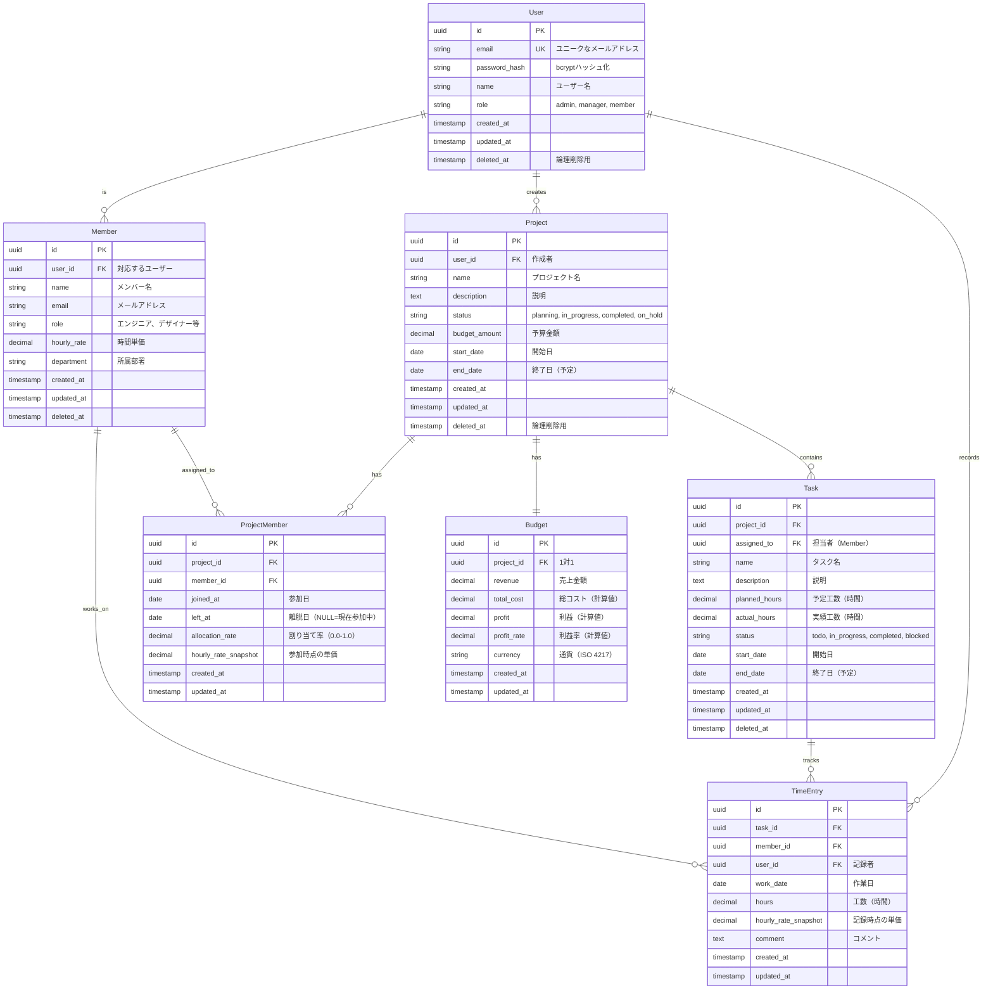

# Data Model Design: プロジェクト予算管理システム

**Date**: 2025-10-11  
**Phase**: Phase 1 - Data Model Design

## ER図

## エンティティ詳細

### 1. User（ユーザー）

システムを利用するユーザーアカウント。

| カラム名 | 型 | NULL | デフォルト | 説明 |
|---------|-----|------|-----------|------|
| id | UUID | NO | gen_random_uuid() | 主キー |
| email | VARCHAR(255) | NO | - | メールアドレス（ログインID） |
| password_hash | VARCHAR(255) | NO | - | bcryptハッシュ化されたパスワード |
| name | VARCHAR(100) | NO | - | ユーザー名 |
| role | VARCHAR(20) | NO | 'member' | ロール: admin, manager, member |
| created_at | TIMESTAMP | NO | CURRENT_TIMESTAMP | 作成日時 |
| updated_at | TIMESTAMP | NO | CURRENT_TIMESTAMP | 更新日時 |
| deleted_at | TIMESTAMP | YES | NULL | 削除日時（論理削除） |

**インデックス:**
- PRIMARY KEY (id)
- UNIQUE INDEX (email) WHERE deleted_at IS NULL
- INDEX (role)
- INDEX (deleted_at)

**制約:**
- email: ユニーク制約（論理削除されていないレコードのみ）
- role: CHECK制約 ('admin', 'manager', 'member')

### 2. Project（プロジェクト）

管理対象のソフトウェア開発プロジェクト。

| カラム名 | 型 | NULL | デフォルト | 説明 |
|---------|-----|------|-----------|------|
| id | UUID | NO | gen_random_uuid() | 主キー |
| user_id | UUID | NO | - | 作成者（User.id） |
| name | VARCHAR(200) | NO | - | プロジェクト名 |
| description | TEXT | YES | NULL | 説明 |
| status | VARCHAR(20) | NO | 'planning' | ステータス |
| budget_amount | DECIMAL(15,2) | YES | NULL | 予算金額 |
| start_date | DATE | YES | NULL | 開始日 |
| end_date | DATE | YES | NULL | 終了日（予定） |
| created_at | TIMESTAMP | NO | CURRENT_TIMESTAMP | 作成日時 |
| updated_at | TIMESTAMP | NO | CURRENT_TIMESTAMP | 更新日時 |
| deleted_at | TIMESTAMP | YES | NULL | 削除日時（論理削除） |

**インデックス:**
- PRIMARY KEY (id)
- INDEX (user_id)
- INDEX (status)
- INDEX (start_date, end_date)
- INDEX (deleted_at)
- INDEX (name) - 検索用

**制約:**
- user_id: FOREIGN KEY (users.id)
- status: CHECK制約 ('planning', 'in_progress', 'completed', 'on_hold')
- end_date >= start_date

### 3. Task（タスク）

プロジェクト内の作業単位。

| カラム名 | 型 | NULL | デフォルト | 説明 |
|---------|-----|------|-----------|------|
| id | UUID | NO | gen_random_uuid() | 主キー |
| project_id | UUID | NO | - | プロジェクトID |
| assigned_to | UUID | YES | NULL | 担当者（Member.id） |
| name | VARCHAR(200) | NO | - | タスク名 |
| description | TEXT | YES | NULL | 説明 |
| planned_hours | DECIMAL(10,2) | YES | 0.00 | 予定工数（時間） |
| actual_hours | DECIMAL(10,2) | YES | 0.00 | 実績工数（時間） |
| status | VARCHAR(20) | NO | 'todo' | ステータス |
| start_date | DATE | YES | NULL | 開始日 |
| end_date | DATE | YES | NULL | 終了日（予定） |
| created_at | TIMESTAMP | NO | CURRENT_TIMESTAMP | 作成日時 |
| updated_at | TIMESTAMP | NO | CURRENT_TIMESTAMP | 更新日時 |
| deleted_at | TIMESTAMP | YES | NULL | 削除日時 |

**インデックス:**
- PRIMARY KEY (id)
- INDEX (project_id)
- INDEX (assigned_to)
- INDEX (status)
- INDEX (deleted_at)

**制約:**
- project_id: FOREIGN KEY (projects.id) ON DELETE CASCADE
- assigned_to: FOREIGN KEY (members.id) ON DELETE SET NULL
- status: CHECK制約 ('todo', 'in_progress', 'completed', 'blocked')
- planned_hours >= 0
- actual_hours >= 0

### 4. Member（メンバー）

プロジェクトに参加するメンバー情報。

| カラム名 | 型 | NULL | デフォルト | 説明 |
|---------|-----|------|-----------|------|
| id | UUID | NO | gen_random_uuid() | 主キー |
| user_id | UUID | YES | NULL | 対応するユーザー |
| name | VARCHAR(100) | NO | - | メンバー名 |
| email | VARCHAR(255) | NO | - | メールアドレス |
| role | VARCHAR(50) | YES | NULL | 役割（エンジニア、デザイナー等） |
| hourly_rate | DECIMAL(10,2) | YES | 0.00 | 時間単価 |
| department | VARCHAR(100) | YES | NULL | 所属部署 |
| created_at | TIMESTAMP | NO | CURRENT_TIMESTAMP | 作成日時 |
| updated_at | TIMESTAMP | NO | CURRENT_TIMESTAMP | 更新日時 |
| deleted_at | TIMESTAMP | YES | NULL | 削除日時 |

**インデックス:**
- PRIMARY KEY (id)
- INDEX (user_id)
- INDEX (email)
- INDEX (deleted_at)

**制約:**
- user_id: FOREIGN KEY (users.id) ON DELETE SET NULL
- hourly_rate >= 0

### 5. ProjectMember（プロジェクトメンバー割り当て）

プロジェクトとメンバーの多対多関係を管理。

| カラム名 | 型 | NULL | デフォルト | 説明 |
|---------|-----|------|-----------|------|
| id | UUID | NO | gen_random_uuid() | 主キー |
| project_id | UUID | NO | - | プロジェクトID |
| member_id | UUID | NO | - | メンバーID |
| joined_at | DATE | NO | CURRENT_DATE | 参加日 |
| left_at | DATE | YES | NULL | 離脱日 |
| allocation_rate | DECIMAL(3,2) | YES | 1.00 | 割り当て率（0.0-1.0） |
| hourly_rate_snapshot | DECIMAL(10,2) | YES | NULL | 参加時点の単価 |
| created_at | TIMESTAMP | NO | CURRENT_TIMESTAMP | 作成日時 |
| updated_at | TIMESTAMP | NO | CURRENT_TIMESTAMP | 更新日時 |

**インデックス:**
- PRIMARY KEY (id)
- UNIQUE INDEX (project_id, member_id, joined_at)
- INDEX (project_id)
- INDEX (member_id)
- INDEX (joined_at, left_at)

**制約:**
- project_id: FOREIGN KEY (projects.id) ON DELETE CASCADE
- member_id: FOREIGN KEY (members.id) ON DELETE CASCADE
- allocation_rate: CHECK制約 (0.0 <= allocation_rate <= 1.0)
- left_at >= joined_at (NULL許容)

### 6. TimeEntry（工数記録）

実績工数の詳細記録。

| カラム名 | 型 | NULL | デフォルト | 説明 |
|---------|-----|------|-----------|------|
| id | UUID | NO | gen_random_uuid() | 主キー |
| task_id | UUID | NO | - | タスクID |
| member_id | UUID | NO | - | 作業者（Member.id） |
| user_id | UUID | NO | - | 記録者（User.id） |
| work_date | DATE | NO | CURRENT_DATE | 作業日 |
| hours | DECIMAL(5,2) | NO | - | 工数（時間） |
| hourly_rate_snapshot | DECIMAL(10,2) | YES | NULL | 記録時点の単価 |
| comment | TEXT | YES | NULL | コメント |
| created_at | TIMESTAMP | NO | CURRENT_TIMESTAMP | 作成日時 |
| updated_at | TIMESTAMP | NO | CURRENT_TIMESTAMP | 更新日時 |

**インデックス:**
- PRIMARY KEY (id)
- INDEX (task_id)
- INDEX (member_id)
- INDEX (user_id)
- INDEX (work_date)
- INDEX (task_id, work_date)

**制約:**
- task_id: FOREIGN KEY (tasks.id) ON DELETE CASCADE
- member_id: FOREIGN KEY (members.id) ON DELETE RESTRICT
- user_id: FOREIGN KEY (users.id) ON DELETE RESTRICT
- hours: CHECK制約 (hours > 0 AND hours <= 24)

### 7. Budget（予算）

プロジェクトの収支情報（1対1）。

| カラム名 | 型 | NULL | デフォルト | 説明 |
|---------|-----|------|-----------|------|
| id | UUID | NO | gen_random_uuid() | 主キー |
| project_id | UUID | NO | - | プロジェクトID（UNIQUE） |
| revenue | DECIMAL(15,2) | YES | 0.00 | 売上金額 |
| total_cost | DECIMAL(15,2) | YES | 0.00 | 総コスト（計算値） |
| profit | DECIMAL(15,2) | YES | 0.00 | 利益（計算値） |
| profit_rate | DECIMAL(5,2) | YES | 0.00 | 利益率（％、計算値） |
| currency | VARCHAR(3) | NO | 'JPY' | 通貨（ISO 4217） |
| created_at | TIMESTAMP | NO | CURRENT_TIMESTAMP | 作成日時 |
| updated_at | TIMESTAMP | NO | CURRENT_TIMESTAMP | 更新日時 |

**インデックス:**
- PRIMARY KEY (id)
- UNIQUE INDEX (project_id)

**制約:**
- project_id: FOREIGN KEY (projects.id) ON DELETE CASCADE
- revenue >= 0
- total_cost >= 0

**計算ロジック:**
- total_cost = SUM(TimeEntry.hours * TimeEntry.hourly_rate_snapshot WHERE task.project_id = project_id)
- profit = revenue - total_cost
- profit_rate = (profit / revenue) * 100 (revenue > 0の場合)

## リレーションシップ

### 1対多
- User → Project (1人のユーザーが複数のプロジェクトを作成)
- User → TimeEntry (1人のユーザーが複数の工数記録を作成)
- Project → Task (1つのプロジェクトが複数のタスクを持つ)
- Task → TimeEntry (1つのタスクが複数の工数記録を持つ)
- Member → TimeEntry (1人のメンバーが複数の工数記録を持つ)

### 1対1
- Project ↔ Budget (1つのプロジェクトが1つの予算情報を持つ)

### 多対多
- Project ↔ Member (ProjectMemberを介した多対多)

## データ整合性

### カスケード削除
- Project削除 → Task削除 → TimeEntry削除
- Project削除 → Budget削除
- Project削除 → ProjectMember削除

### 論理削除
- User, Project, Task, Member は論理削除（deleted_atを使用）
- TimeEntry, ProjectMember, Budget は物理削除（親エンティティのカスケード）

### トリガー（将来実装）
- TaskのTimeEntry更新時 → Task.actual_hours自動更新
- TimeEntry作成/更新/削除時 → Budget.total_cost再計算
- Budget.revenue更新時 → Budget.profit, profit_rate再計算

## インデックス戦略

### 検索最適化
- 頻繁に検索されるカラム: status, dates, deleted_at
- 外部キー: 全てにインデックス
- 複合インデックス: よく一緒に検索されるカラムの組み合わせ

### パフォーマンス考慮
- UUIDの代わりに連番を使う選択肢も検討可能
- GORM の Preload/Joins を活用してN+1問題を回避

## マイグレーション順序

1. Users
2. Projects
3. Tasks
4. Members
5. TimeEntries
6. ProjectMembers
7. Budgets

## 制約と注意事項

### データ型の選択理由
- **UUID**: グローバルユニーク性、分散システム対応
- **DECIMAL**: 金額・工数の正確な計算（浮動小数点誤差回避）
- **TIMESTAMP**: タイムゾーン対応、監査用

### 単価のスナップショット
- ProjectMember.hourly_rate_snapshot: 参加時点の単価を保存
- TimeEntry.hourly_rate_snapshot: 記録時点の単価を保存
- 理由: 単価変更が過去のデータに影響しないようにする

### 通貨対応
- 初期バージョンではJPY固定
- 将来的に複数通貨対応可能な設計（currency カラム）

---

**Status**: Draft  
**Next**: マイグレーションファイル作成  
**Date**: 2025-10-11
